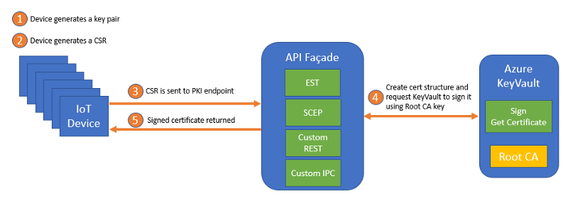

# Some Context

Please refer to [this blog post](https://vslepakov.medium.com/build-a-lightweight-pki-for-iot-using-azure-keyvault-acc46bce26ed) for details.  



# Prerequisites

## Create an Azure Key Vault:  
```az keyvault create --name <KEYVAULT_NAME> \```  
```--resource-group keyvault-ca \```  
```--enable-soft-delete=true \```  
```--enable-purge-protection=true```  

## Setup Key Vault access for the Console App

Both the Console App and the Web API use the [DefaultAzureCredential](https://github.com/Azure/azure-sdk-for-net/blob/main/sdk/identity/Azure.Identity/README.md#defaultazurecredential) for accessing the Key Vault.
When running locally, they will use the developer authentication and, in the cloud, managed identity.

You need to first aquire the object ID of your Azure user:

```az ad user show --id <YOUR_EMAIL_ADDRESS>```

and then give it accesss to the Key Vault keys and certificates:  
```az keyvault set-policy --name <KEYVAULT_NAME> \```  
```--object-id <OBJECT_ID> \```  
```--key-permissions sign \```  
``` --certificate-permissions get list update create```  

# Getting Started

Clone this repository. There are two projects (`KeyVaultCA` and `KeyVaultCA.Web`) containing `appsettings.json` files. The settings specified there can also be overridden with environment variables or command line arguments.
The following common block must be filled in, for all usages of the projects.
```
"KeyVault": {
    "KeyVaultUrl": "<Key Vault URL>",
    "IssuingCA": "<Name of the issuing certificate in KeyVault.>"
  }
```
For overriding settings from command line arguments on Linux, use a syntax similar to `KeyVault__KeyVaultUrl` and for Windows, `KeyVault:KeyVaultUrl`.

# Use the Console application
## Generate a new Root CA in Key Vault

Run the API Facade like this (feel free to use your own values for the subject):  
```cd KeyVaultCA```  
```dotnet run --Csr:IsRootCA "true" --Csr:Subject "C=US, ST=WA, L=Redmond, O=Contoso, OU=Contoso HR, CN=Contoso Inc"``` 

## Request a new device certificate

1. First generate the private key:  
```openssl genrsa -out mydevice.key 2048```  

2. Create the CSR:  
```openssl req -new -key mydevice.key -out mydevice.csr```  
```openssl req -in mydevice.csr -out mydevice.csr.der -outform DER```

3. Run the API Facade and pass all required arguments:   
```cd KeyVaultCA```  
```dotnet run --Csr:IsRootCA "false" --Csr:PathToCsr <PATH_TO_CSR_IN_DER_FORMAT> --Csr:OutputFileName <OUTPUT_CERTIFICATE_FILENAME>```

If desired, values can also be set in the `Csr` block of the `appsettings.json`.
```
"Csr": {
    "IsRootCA": "<Boolean value. To register a Root CA, value should be true, otherwise false.>",
    "Subject": "<Subject in the format 'C=US, ST=WA, L=Redmond, O=Contoso, OU=Contoso HR, CN=Contoso Inc'.>",
    "PathToCsr": "<Path to the CSR file in .der format.>",
    "OutputFileName": "<Output file name for the certificate.>"
  }
```

# Use the [EST](https://tools.ietf.org/html/rfc7030) Façade Web API to request a certificate

DISCLAIMER: NOT all of the EST methods are implemented. It is only:
- [/cacerts](https://tools.ietf.org/html/rfc7030#section-4.1)
- [/simpleenroll](https://tools.ietf.org/html/rfc7030#section-4.2)

The endpoints above are used by and work with Azure IoT Edge 1.2 which supports certificate enrollment via EST.

When calling the EST endpoints for:
- generating the device identity certificate (needed for authenticating to the IoT Hub), use the URL like in the example - `https://example-est.azurewebsites.net/.well-known/est`
- generating the Edge CA certificate (needed for authenticating the IoT edge modules), use `ca` as part of the URL - e.g. `https://example-est.azurewebsites.net/ca/.well-known/est`.

Provide the following variables in the `appsettings.json` of the `KeyVaultCA.Web` project, which will also be used when publishing the Web API to Azure:  
  
1. ```KeyVaultUrl``` - url of your KeyVault the format depending on whether it is accessible via public or private endpoint:
    - for a public endpoint, the format is `https://<KEYVAULT_NAME>.vault.azure.net/`
    - for a private endpoint with Azure built-in DNS integration, the format is `https://<KEYVAULT_NAME>.privatelink.vaultcore.azure.net/`
    - for a private endpoint with custom DNS integration, the format is `https://<KEYVAULT_NAME>.vaultcore.azure.net/`
2. ```IssuingCA``` - name of the certificate in the KeyVault to issue your leaf certificate.  
3. ```CertValidityInDays``` - specifies validity period for issued certificates (maximum is 365 days).  
4. ```Auth``` - Authentication mode for the EST API. Possible values are: 
- **Basic** - add the following environment variables: 
    - ```EstUsername``` - username for the EST endpoint
    - ```EstPassword``` - password for the EST endpoint 
- **x509** - via certificates
    - put your trusted CA certificates into the ```KeyVaultCA.Web\TrustedCAs``` folder. Make sure to specify CopyToOutput. Note that certificates downloaded from Azure Key Vault are by default encoded as a base64 string.  
   -  if you choose to publish the ```KeyVaultCA.Web``` app to an Azure App Service, make sure to go to **Configuration** -> **General Setttings** -> **Incoming client certificates** -> set **Client certificate mode** to `Require`. 

To ensure that the published Web API can access the Key Vault, go to the App Service that will host the `KeyVaultCA.Web`, click on **Identity** and turn on the `System-Assigned` one. 

Then go to the Key Vault and create a new access policy for the same identity with:
- *Key Permissions*: Sign
- *Certificate Permissions*: Get, List, Update, Create.

The implementation returns the `IssuingCA` via the ```/cacerts``` endpoint.  
Refer to [this repo](https://github.com/arlotito/iot-edge-1.2-tpm) for details on IoT Edge configuration, including PKCS#11 and EST.

## Logging

The `KeyVaultCA` console app uses a Console logger, for which the severity can be changed in the `appsettings.json`.

The `KeyVaultCA.Web` writes logs to an Azure Application Insights instance, for which the connection string must be added in the `appsettings.json`. Additionally, the logging must be turned on from the Azure portal by going to the Web App and into the Application Insights settings.
